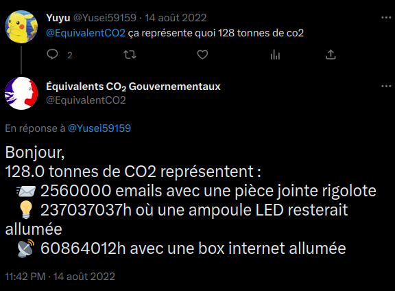

# EquivalentCO2

EquivalentCO2 est un bot twitter qui permet de donner une équivalence entre une quantité de CO2 donnée et les efforts demandés par le gouvernement.

## Installation

```console
git clone https://github.com/Bandamo/EquivalentCO2 
cd EquivalentCO2
pip install -r requirements.txt
```

Pour des raisons de confidentialité, le dossier "private" n'est pas disponible sur le dépôt. Il faut donc créer un dossier "private" à la racine du projet et y ajouter un fichier "config.py" avec les informations suivantes :

Pour cela lancez le programme de configuration :

```console
python3 config.py
```

Le programme vous demandera de rentrer les informations suivantes :
- Votre clé d'API Twitter
- Votre clé secrète d'API Twitter
- Votre jeton d'accès Twitter
- Votre jeton d'accès secret Twitter
- Votre jeton "Bearer" pour l'API de Twitter

Lancez ensuite le programme :

```console
python3 main.py
```

Le serveur est maintenant lancé et le bot twitter est prêt à être utilisé.

## Utilisation

Le bot twitter est lancé et prêt à être utilisé. Il est possible de l'utiliser en direct sur Twitter.

Publiez en mentionnant le bot un tweet contenant une quantité de CO2 et le bot vous répondra avec l'équivalence.

Exemple :

[]
